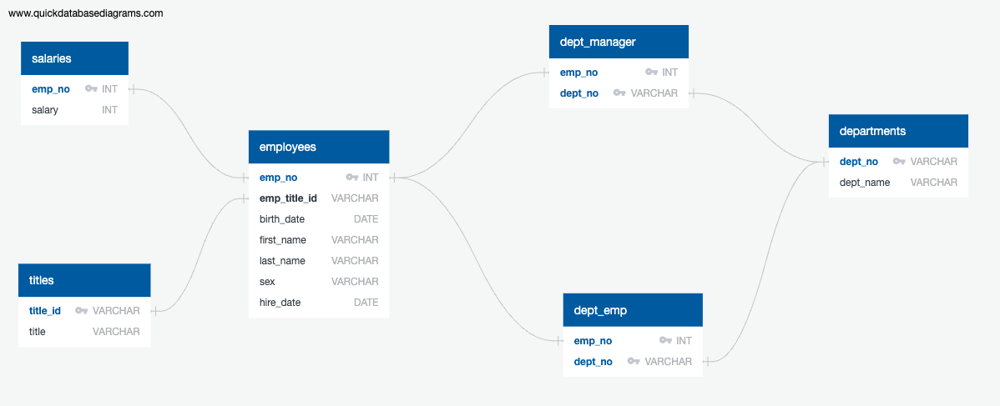

# Pewlett Hackard Employee Database

## Background

As a newly appointed data engineer at Pewlett Hackard, a hypothetical company, I have been tasked with spearheading a comprehensive research project focused on the company's workforce during the 1980s and 1990s. The extant data pertaining to this era encompasses six CSV files.

My responsibilities in this project encompass the conceptualization of tables to accommodate the CSV data, the transfer of the CSV files into a SQL database, and subsequent analysis. These tasks will cover various aspects such as data modeling, data engineering, and data analysis.

## Project Structure

### Files

- `departments.csv`
- `dept_emp.csv`
- `dept_manager.csv`
- `employees.csv`
- `salaries.csv`
- `titles.csv`
- `schema.sql`
- `data_analysis.sql`
- `quick_db_diagrams.txt`
- `ERD.png`

### Tables

- **departments**
  - `dept_no` (VARCHAR, Primary Key)
  - `dept_name` (VARCHAR)

- **titles**
  - `title_id` (VARCHAR, Primary Key)
  - `title` (VARCHAR)

- **employees**
  - `emp_no` (INT, Primary Key)
  - `emp_title_id` (VARCHAR, Foreign Key - references `titles.title_id`)
  - `birth_date` (DATE)
  - `first_name` (VARCHAR)
  - `last_name` (VARCHAR)
  - `sex` (VARCHAR)
  - `hire_date` (DATE)

- **dept_emp**
  - `emp_no` (INT, Primary Key, Foreign Key - references `employees.emp_no`)
  - `dept_no` (VARCHAR, Primary Key, Foreign Key - references `departments.dept_no`)

- **dept_manager**
  - `emp_no` (INT, Primary Key, Foreign Key - references `employees.emp_no`)
  - `dept_no` (VARCHAR, Primary Key, Foreign Key - references `departments.dept_no`)

- **salaries**
  - `emp_no` (INT, Primary Key, Foreign Key - references `employees.emp_no`)
  - `salary` (INT)

## ERD

## Quick DB Diagram

The quick DB diagram provides a visual overview of the database schema, showing the relationships between tables and the primary and foreign keys. You can find the diagram in `quick_db_diagrams.txt`.

## Sources

- [Visual Representation of SQL Joins](https://www.codeproject.com/Articles/33052/Visual-Representation-of-SQL-Joins)
- [SQLAlchemy Documentation](https://docs.sqlalchemy.org/en/20/)
